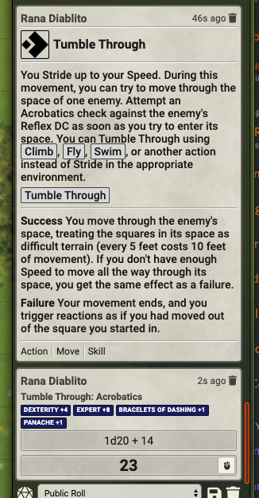
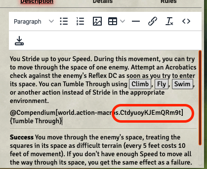

# Skill Action Macros

These scripts allow for a way to let the player make specific Skill Action Checks (i.e., Trip, Grapple, Tumble Through) and include bonuses predicated from rule elements. These were specifically designed with my Swashbuckler Rule Elements, but could be expanded to others.

## Supported Versions

These scripts were written for FoundryVTT 0.7.9 with PF2E version 1.10.27.

## Usage
The new hotness is my updated Tumble Through stuff. Everything else is "Older Stuff."



### Tumble Through

There are two bits to this: one is the Tumble Through macro, available here: [m-tumble-through.js](m-tumble-through.js). What I did is built a custom macro compendium in my world (called "Action Macros") and copied the Tumble Through macro into it. Once that was done, I editted my Tumble Through Action Item and changed the HTML. Basically, you have to edit the HTML directly and change it to the contents of [tumble-through-action.html](tumble-through-action.html). I've provided it as reference, but you really only need to add a single line:

```HTML
<p><a class="entity-link" draggable="false" data-pack="world.action-macros" data-id="CtdyuoyKJEmQRm9t">Tumble Through</a></p>
```
You MAY want to change the name in `data-pack`, depending on what you called your Macro Compendium. You will undoubtedly need to change the ID in `data-id`. You have to set it equal to the ID of the macro in your Macro Compendium. You can figure out the Macro ID a few ways. The easiest way is to drag the macro into the entry (when you're NOT editing the HTML directly). FoundryVTT will make a link to the macro that contains the ID.



Just copy the Macro ID,the part between the . and the ], into the `data-id` field of the HTML provided here.

### Older Stuff

There are only two macros right now: [m-trip.js](m-trip.js); and [m-grapple.js](m-grapple.js). These correspond to the yeo actions: Trip and Grapple. All they do is roll the appropriate skill check but add a "roll option" associated with that action. For example, the Tumble Through macro rolls an Acrobatics check but adds the _tumble-through_ roll option to it. If there is something on the character that adds a bonus based on the _tumble-through_ roll option, it will be included.

The best example (right now) is the Panache Rule Element, which adds a +1 bonus to Tumble Through checks. If you have Panache toggled on and run the Tumble Through macro, you will see a +1 bonus added to the roll for Panache.

I implemented them by creating a Macro Compendium and then adding that compendium to one of the Token Action HUD menus.

## Planned Updates

1. Figure out a better way to do all of this.