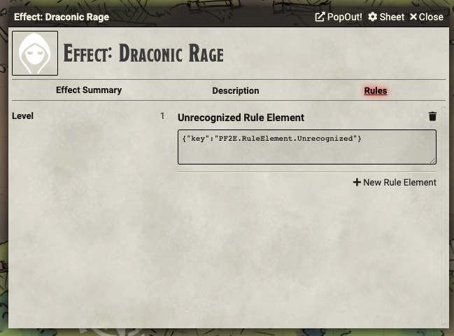

# Barbarian Rage

These scripts are intended to make the Barbarian Rage work in FoundryVTT. It's still very preliminary; basically, it's just enough to make it work for the player at my table that's a Barbarian.

## Supported Versions

These scripts were written for FoundryVTT 0.6.6 with PF2E version 1.10.10.1973.

## Usage

This folder contains five files: one .JS files corresponding to the Macro to toggle Rage and four .JSON files corresponding to Rules Elements for an Effect Item. In order to use these, you will have to turn on the _Advanced Rules Element UI_ in the PF2E System Settings.

### Creating the Effect Item

This macro set requires that a new Effect Item. Create a new Item of type Effect in the World's Item Directory. You can give it whatever name you'd like; I use "Effect: Draconic Rage" so it's clear to everybody what it is. You will want to give it an image because the image you select will appear on the token of the character to which you apply the rage. You can fill in the Description however you want; it's not SUPER important.

In the Rule Element section, you need to add the five rules: [rule-barbarianRageDraconic-1.json](./rule-barbarianRageDraconic-1.json), [rule-barbarianRageDraconic-2.json](./rule-barbarianRageDraconic-2.json), [rule-barbarianRage-3.json](./rule-barbarianRage-3.json), and [rule-barbarianRage-4.json](./rule-barbarianRage-4.json), and [rule-barbarianRage-5.json](./rule-barbarianRage-5.json). The first two rules add the damage bonus (for both agile and non-agile weapons). The third rule adds the AC penalty. The fourth rule adds temporary hit points. The fifth rule just makes the icon appear on the token. This will allow a Barbarian with the Dragon Instinct class feature to use Rage.

You will also want to create a similar Effect Item for Fury Rage called "Effect: Fury Rage," and apply [rule-barbarianRageFury-1.json](./rule-barbarianRageFury-1.json), [rule-barbarianRageFury-2.json](rule-barbarianRageFury-3.json), and rules 3 & 4 that you used for the Draconic Rage. This will allow a Barbarian with the Fury Instinct class feature to use Rage.

**NOTE**: The rules here is set for the damage modifier associated with Draconic and Fury Rage. Other Rages may have different rules; I haven't gotten to those yet, so your results may vary.

With the Effect Item created, you can now add Draconic Rage to a PC by dragging the Item onto a PC Character Sheet. It will appear in the Effects Tab of the Character Sheet. With it added to the character, all of the effects will be applied to the character.

## Planned Updates

1. Add support for different kinds of Rages.