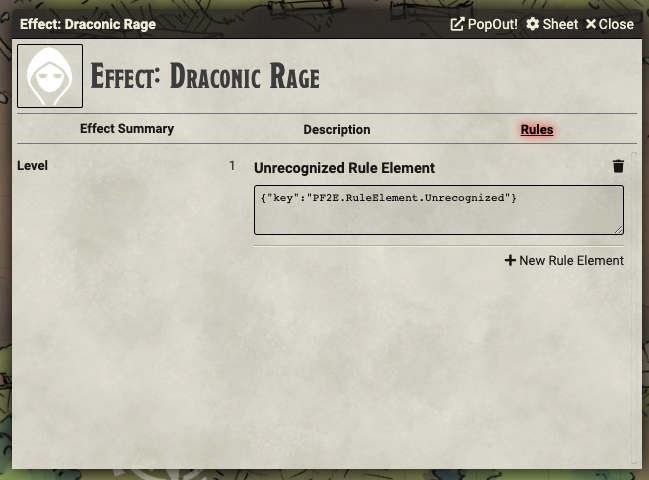

# Monk Stances

These scripts are intended to make the Monk Stances work in FoundryVTT. It's mostly functional (at least for Mountain Stance). There are a few things that are not quite properly supported; I've made notes where I could.

## Supported Versions

These scripts were written for FoundryVTT 0.7.9 with PF2E version 1.10.23.2638.

## Usage

This folder contains a series of .JSON files corresponding to the rule elements necessary to create specific Monk Stances. In order to use these, you will have to turn on the _Advanced Rules Element UI_ in the PF2E System Settings.

### Creating the Effect Item

This macro set requires that a new Effect Item. Create a new Item of type Effect in the World's Item Directory. You can give it whatever name you'd like; I use "Stance: Implacable Mountain" so it's clear to everybody what it is. You will want to give it an image because the image you select will appear on the token of the character to which you apply the stance. You can fill in the Description however you want; it's not SUPER important.

The next thing you want to do is go to the Rule Element tab, pictured below. If you don't see this tab, you'll need to enable the _Advanced Rules Element UI_ in the PF2E System Settings.

In the Rule Element section, you need to add the the rules associated with the stance you are building. For the Mountain Stance, you will want to use: [rule-mountain-stance-1.json](./rule-mountain-stance-1.json), [rule-mountain-stance-2.json](./rule-mountain-stance-2.json), [rule-mountain-stance-3.json](./rule-mountain-stance-3.json), [rule-mountain-stance-4.json](./rule-mountain-stance-4.json), and [rule-mountain-stance-5.json](./rule-mountain-stance-5.json). The first rule adds the Falling Stone unarmed attack. The second and third rule add the +4 item bonus to AC and set the Dexterity modifier cap to +0. The fourth rule just makes the icon appear on the token. The fifth rune adds the speed penalty.

**NOTE**: At this time, I did not implement a rule for the circumstnace bonus to defenses against being SHoved or Tripped.

Once you've built this item, you can use it by dragging the Effect Item to the PC that you want to have it. With the current version of FoundryVTT, you can either drag it onto their character sheet or onto their token. To end the Mountain Stance, delete the Effect Item by either clicking the trash can icon on the Effects tab of the character sheet or right-click the Effect Icon from the Effect tracker in the upper-right hand corner of the display.

**NOTE**: This will not stack properly with armor potency runes or bracers of armor. If your character has either of those, I recommend changing the bonus in Rule #2 to be equal to 4 + the potency rune.

## Planned Updates

1. Add support for different stances.