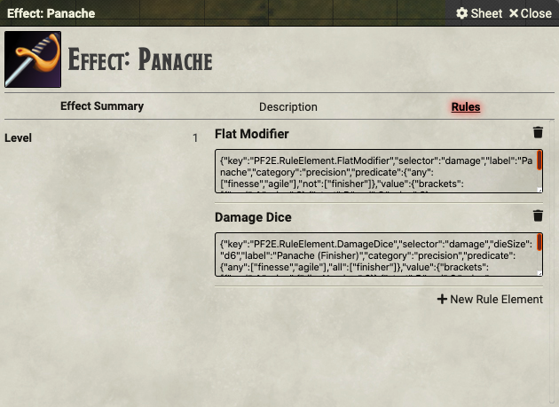

# Swashbuckler Panache

These scripts are intended to make the Swashbuckler Panache available.

## Supported Versions

These scripts were written for FoundryVTT 0.6.6 with PF2E version 1.10.10.1973.

## Usage

This folder contains four files: two .JS files corresponding to Macros and two .JSON files corresponding to Rules Elements for an Effect Item.

### Creating the Effect Item

This macro set requires that a new Effect Item. Create a new Item of type Effect in the World's Item Directory. You can give it whatever name you'd like; I use "Effect: Panache" so it's clear to everybody what it is. In the Rule ELement section, you need to add the two rules: [rule-panache-1.json](./rule-panache-1.json) and [rule-panache-2.json](./rule-panache-2.json). The First Rule adds the Panache Precise Strike damage for normal attacks while the Second Rule adds the Precise Strike damage for Finisher attacks.

With the Effect Item created, you can now add Panache to a PC by dragging the Item onto a PC Character Sheet. It will appear in the Effects Tab of the Character Sheet. With it added to the character, the flat Precise Strike damage will be applied to all attacks made with an agile or finesse weapon.

### Using the Toggle Panache Macro

The [m_togglePanache.js](./m_togglePanache.js) script is used as a convenient way to toggle Panache on and off. It also adds an Effect indicator on the Token and creates a Chat Message indicating the addition or removal of Panache. Create a macro in FoundryVTT and copy the text of the file into the Macro box. Make sure that it is set to *script* macro and not *chat* macro.

There are two options that you can change at the top of the script: *effectName* and *imagePath*. *effectName* is the name of the Effect Item that you created before. If you named it "Effect: Panache" you will not need to change the script. However, if you named it something else, just change the value of *effectName*. *imagePath* is the path in your FoundryVTT assets folder to the image you want to use on the token to represent that the character has Panache. I have included the image I use (a luchador mask) if you want to use it. Just copy it to the appropriate location in your assets folder.

Once you have set those two options, the macro should correctly toggle Panache on and off. When it is on, you should see an Effect icon on the character token and the Panache Effect Item listed on the Character Sheet. I recommend that you use the macro to add and remove Panache, as it will remove both the Effect Item and the token icon.

### Using the Confident Finisher Macro

The script [m_confidentFinisher.js](./m_confidentFinisher.js) is used to have the character roll the damage for their Confident Finisher attack. It requires that Panache be active. Create a new macro and copy the contents of the file the Macro box. Make sure that it is set to *script* macro and not *chat* macro.

There are three options that you can change at the top of the script: *effectName*, *weaponName*, and *toggleMacroName*. *effectName* is the same as it was in the **Toggle Panache** Macro. *weaponName* is the name of the specific weapon to be used with the Confident Finisher. At this time, this macro does not support using different weapons (although it could be changed at play time to accomodate that). For example, if the player is using a weapon named "Awesome Rapier," just change the value of *weaponName* accordingly. *toggleMacroName* is the name that you gave to the **Toggle Panache** Macro, above. It defaults to "Toggle Panache," but if you call your macro something different, change the name accordingly. This is used at the end of the Confident Finisher to remove Panache at the end of the attack.

## Planned Updates

(1) Add a dialogue box to the Confident Finisher so the user can select normal damage, critical damage, or miss.
(2) Add support for the Precise Finisher Feat.