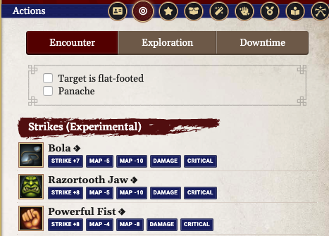

# Swashbuckler Panache

These scripts are intended to make the Swashbuckler Panache work in FoundryVTT. It's still very preliminary; basically, it's just enough to make it work for the player at my table that's a Swashbuckler.

## Supported Versions

These scripts were written for FoundryVTT 0.6.6 with PF2E version 1.10.13.2079.

## Usage

This folder contains four files: two .JS files corresponding to Macros and five .JSON files corresponding to Rules Elements for an Item. There's also a .JSON file containing the exported data for a Class Feature/Feat Item, in case you have trouble making your own.

### Creating the Effect Item

**NOTE: This requires activating the "Advanced Rules Element UI" in the System Settings.**

This macro set requires either creating a new Item or modifying an existing one, such as the Panache Class Feature. I recommend that you copy the Panache Class Feature from the PF2E Compendium. In the Rule Element section, you need to add three rules. The content of these elements can be found in the following files: [rule-panache-1.json](./rule-panache-1.json); [rule-panache-2.json](./rule-panache-2.json); and [rule-panache-3.json](./rule-panache-3.json). The First Rule adds the Panache Precise Strike damage for normal attacks while the Second Rule adds the Precise Strike damage for Finisher attacks. The Third Rule creates a toggle for Panache in the Actions tab of the PC Character Sheet.

With those modifications made, add the Class Feature Item to the character for which you want to give Panache. You should see the Panache toggle in the Actions tab. At this point, you can "apply" Panache to the character by using that toggle. The Precise Strike damage will be applied to all agile or finesse attacks.

**NOTE**: I have also added an exported version of my Class Feature Item as well which you can try toimport if you have trouble setting it up yourself. You can find that item here in the file [fvtt-Item-Panache.json](./fvtt-Item-Panache.json). However, this may not work, so adding the rule elements to your own item is preferred.

### Using the Toggle Panache Macro

The [m_togglePanache.js](./m_togglePanache.js) script is used as a convenient way to toggle Panache on and off. It also adds an Effect indicator on the Token and creates a Chat Message indicating the addition or removal of Panache. Create a macro in FoundryVTT and copy the text of the file into the Macro box. Make sure that it is set to *script* macro and not *chat* macro.

There is one option that you can change at the top of the script: *imagePath*. *imagePath* is the path in your FoundryVTT assets folder to the image you want to use on the token to represent that the character has Panache. I have included the image I use (a luchador mask) if you want to use it. Just copy it to the appropriate location in your assets folder.

Once you have set those two options, the macro should correctly toggle Panache on and off. When it is on, you should see an Effect icon on the character token and the Panache toggle active on the Actions tab of the character sheet. If you don't mind toggling Panache from the character sheet, the macro is unnecessary.

### Using the Confident Finisher Macro

The script [m_confidentFinisher.js](./m_confidentFinisher.js) is used to have the character roll the damage for their Confident Finisher attack. It requires that Panache be active. Create a new macro and copy the contents of the file the Macro box. Make sure that it is set to *script* macro and not *chat* macro.

There are three options that you can change at the top of the script: *weaponName*, and *toggleMacroName*. *weaponName* is the name of the specific weapon to be used with the Confident Finisher. At this time, this macro does not support using different weapons (although it could be changed at play time to accomodate that). For example, if the player is using a weapon named "Awesome Rapier," just change the value of *weaponName* accordingly. *toggleMacroName* is the name that you gave to the **Toggle Panache** Macro, above. It defaults to "Toggle Panache," but if you call your macro something different, change the name accordingly. This is used at the end of the Confident Finisher to remove Panache at the end of the attack.

## Planned Updates

1. [COMPLETED] Add a dialogue box to the Confident Finisher so the user can select normal damage, critical damage, or miss.
2. Add support for the Precise Finisher Feat.
3. [COMPLETED] Update for use with Toggle Rule Element.
4. Update Confident Finisher to not rely on toggle macro.